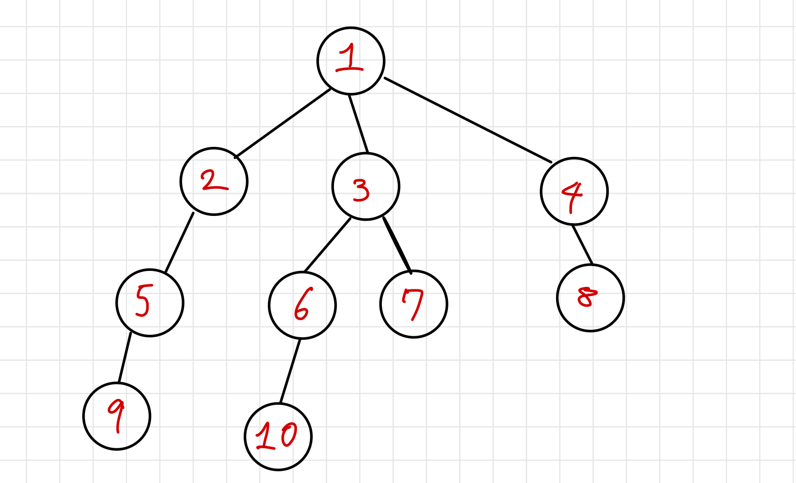

# BFS

> Breadth First Search (너비 우선 탐색)

</img>

시작점인 root 노드와 같은 거리에 있는 노드를 우선으로 방문

큐(Queue)를 사용해 노드를 방문하면서 인접한 노드 중 방문하지 않았던 노드의 정보를 큐에 넣어 먼저 큐에 들어있던 노드를 방문

but 큐를 사용하지 않아도 구현이 가능하긴함

# DFS

> Depth First Search (깊이 우선 탐색)

시작점인 root에서 갈 수 있는 한 끝까지 탐색해 leaf 노드를 방문하고 이전에 방문하지 않았던 노드를 선택해 방문

스택(Stack)을 사용해 구현
