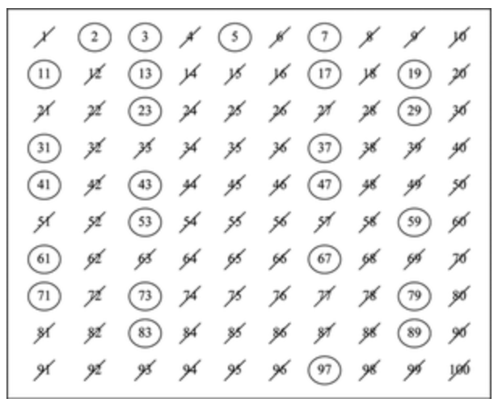

# Sieve of Eratosthenes (에라토스테네스의 체)

> 범위에서 합성수를 지우는 방식으로 소수를 찾는 방법

</img>

1. 1은 제거
2. 지워지지 않은 수 중 제일 작은 2를 소수로 채택하고, 나머지 2의 배수를 모두 지운다.
3. 지워지지 않은 수 중 제일 작은 3을 소수로 채택하고, 나머지 3의 배수를 모두 지운다.
4. 지워지지 않은 수 중 제일 작은 5를 소수로 채택하고, 나머지 5의 배수를 모두 지운다.
5. (반복)
